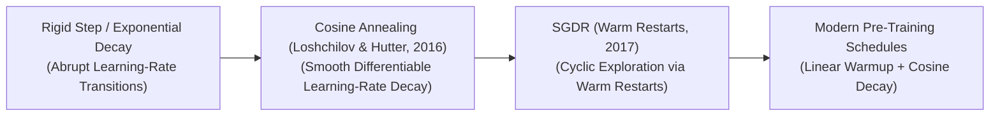
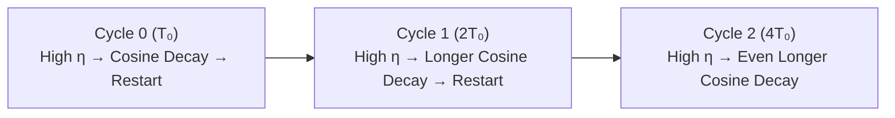

# Awesome-Cosine-Annealing
## Cosine Annealing in AI: Derivation, Progression, Variants, & Applications

**Cosine Annealing** is a hardware-aware hyperparameter optimization paradigm that dynamically modulates the Learning Rate ($\eta$) of a neural network during backpropagation training loops. Introduced by Ilya Loshchilov and Frank Hutter in 2016 ("SGDR: Stochastic Gradient Descent with Warm Restarts"), Cosine Annealing replaces traditional rigid decay schedules (such as step decay or linear drops) with a continuous, smooth wave trajectory modeled on a cosine function. 

By systematically dropping the learning rate from a high peak velocity down to a microscopic baseline value across a fixed chronological window, the optimizer allows hidden layer weights to rapidly navigate wide error valleys, settle precisely into a deep local minimum, and optionally burst out to explore alternative topological regions via structured resets.

---

## 1. Mathematical Derivation

The foundational formulation of Cosine Annealing derives the learning rate at a given training epoch or step $T_{cur}$ by mapping a half-period cosine curve bounded between a maximum targeted learning rate ($\eta_{max}$) and a minimum baseline floor ($\eta_{min}$).

### A. The Baseline Optimization Problem
We wish to construct a continuous schedule function $\eta(T_{cur})$ spanning a total allocation window of $T_{max}$ training steps such that:
1. At the initial initialization step ($T_{cur} = 0$), the learning rate is locked at peak velocity: $\eta(0) = \eta_{max}$.
2. At the terminal execution step ($T_{cur} = T_{max}$), the learning rate converges precisely on its floor: $\eta(T_{max}) = \eta_{min}$.
3. The transition curve between these two boundaries is smoothly differentiable, suppressing sudden gradient shocks across hidden parameters.

### B. Core Geometric Mapping
We leverage the native properties of the cosine function, which sweeps smoothly from $1$ to $-1$ across a radian period of $\pi$:
$$\cos(0) = 1, \quad \cos\left(\frac{\pi}{2}\right) = 0, \quad \cos(\pi) = -1$$

To scale the horizontal axis such that the curve moves exactly from $0$ to $\pi$ as $T_{cur}$ advances from $0$ to $T_{max}$, we define the input angle variable as:
$$\theta = \frac{T_{cur}}{T_{max}}\pi$$

Passing this angle through the cosine function yields a standard oscillating wave:
$$f(T_{cur}) = \cos\left(\frac{T_{cur}}{T_{max}}\pi\right)$$

### C. Scaling and Boundary Adjustment
To map the vertical range of this function (which spans from $1$ down to $-1$) to our target optimization range (from $\eta_{max}$ down to $\eta_{min}$), we perform a series of algebraic transformations:

1. **Shift and Halve:** Add $1$ to the function and divide by $2$ to compress the range from $[-1, 1]$ down to a clean normalized interval of $[0, 1]$:
   $$g(T_{cur}) = \frac{1}{2} \left( 1 + \cos\left(\frac{T_{cur}}{T_{max}}\pi\right) \right)$$
   * Verification: At $T_{cur} = 0 \rightarrow \frac{1}{2}(1 + 1) = 1$. At $T_{cur} = T_{max} \rightarrow \frac{1}{2}(1 - 1) = 0$.

2. **Scale Delta:** Multiply the normalized function by the difference between our maximum and minimum targeted boundaries ($\eta_{max} - \eta_{min}$):
   $$h(T_{cur}) = \frac{\eta_{max} - \eta_{min}}{2} \left( 1 + \cos\left(\frac{T_{cur}}{T_{max}}\pi\right) \right)$$

3. **Incorporate Baseline Floor:** Shift the entire system upward by adding $\eta_{min}$ to establish the complete structural equation:
   $$\eta_t = \eta_{min} + \frac{\eta_{max} - \eta_{min}}{2} \left( 1 + \cos\left(\frac{T_{cur}}{T_{max}}\pi\right) \right)$$

---

## 2. The Macro Chronological Evolution

The implementation of optimization learning rates has transitioned from rigid manual staircases to continuous waveforms, structured restarts, and modern warmup-fused pre-training schedulers.

| Era / Concept | Details | Year First Used | Paper Link |
| :--- | :--- | :--- | :--- |
| [**The Discontinuous Step & Heuristic Decay Era (Traditional ML, Pre-2016)**](details/discontinuous_step_decay.md) | **Concept:** The structural baseline. Learning rates were scaled down manually using rigid step-staircases (e.g., dropping the learning rate by a factor of 10 every 30 epochs) or smooth exponential curves ($e^{-\lambda t}$).  **Limitation:** Heavy hyperparameter tuning tax and parameter gradient shocks. Step decay required manual intervention, and the sudden, instantaneous drop in learning rate introduced severe numerical shocks to the hidden layers, often destabilizing or stagnating convergence. | 2013 | [Sutskever et al. (2013)](https://proceedings.mlr.press/v28/sutskever13.pdf) |
| [**The Continuous Waveform Revolution (Vanilla Cosine Annealing, 2016)**](details/vanilla_cosine_annealing.md) | **Concept:** Formally established by Loshchilov and Hutter. It replaced abrupt drops with a smooth mathematical wave. Because the function is monotonically decreasing and continuously differentiable, weight updates decelerate smoothly as they approach local minima, mimicking the cooling physics of thermodynamic annealing. | 2016 | [Loshchilov & Hutter (2016)](https://arxiv.org/abs/1608.03983) |
| [**The Cyclic Restarts Era (SGDR / Stochastic Optimization with Restarts)**](details/cyclic_restarts_sgdr.md) | **Concept:** Addressed the problem of getting trapped in sub-optimal local minima or sharp saddle zones. Instead of terminating the run when the learning rate hits its floor ($\eta_{min}$), **SGDR** abruptly pops the learning rate back up to peak velocity ($\eta_{max}$), launching a new, expanded cosine period window.  **Significance:** The sudden learning rate burst acts as a controlled kinetic explosion, shaking the model parameters out of local minima to find deeper, wider, and more robust global minima across the loss landscape. | 2016 | [Loshchilov & Hutter (2016)](https://arxiv.org/abs/1608.03983) |
| [**The Linear Warmup & Unified Transformer Pre-Training Era (~2020–Present)**](details/linear_warmup_transformer.md) | **Concept:** The modern state-of-the-art framework driving frontier Large Language Models (such as Llama 3 and DeepSeek-V3). It couples Cosine Annealing with a **Linear Warmup phase** at step zero.  **Significance:** Prevents parameter explosion during the early, highly unstable steps of training over trillions of tokens by climbing linearly from zero to peak velocity before activating a monotonic cosine decay toward the target context horizon. | 2017 | [Vaswani et al. (2017)](https://arxiv.org/abs/1706.03762) |

---

## 3. Core Structural & Chronological Schedulers

Cosine Annealing frameworks are categorized based on how the period windows are dynamically adjusted and recycled across successive optimization runs.

| Scheduler Variant | Description & Details | Year First Used | Paper Link |
| :--- | :--- | :--- | :--- |
| [**Monotonic Cosine Decay (No Restarts)**](details/monotonic_cosine_decay.md) | **Mechanism:** Runs across a single, unbroken timeline where $T_{max}$ matches the total epoch budget of the complete training run.  **Behavior:** The baseline default standard for pre-training transformers, steadily cooling parameter updates until the loss curve plateaus cleanly. | 2016 | [Loshchilov & Hutter (2016)](https://arxiv.org/abs/1608.03983) |
| [**Cosine Annealing with Warm Restarts (SGDR Class)**](details/cosine_annealing_warm_restarts.md) | **Mechanism:** Cycles the learning rate across successive periods ($T_i$). When the current step hits the local horizon, the schedule resets $T_{cur} \leftarrow 0$, initializing a new cosine cycle.  **Period Expansion ($T_{mult}$):** To prevent the model from cycling chaotically, modern variants scale the length of each successive period using a multiplier (typically $T_{mult} = 2$), doubling the training window after every restart:  $$T_i = T_{0} \times (T_{mult})^i$$ | 2016 | [Loshchilov & Hutter (2016)](https://arxiv.org/abs/1608.03983) |
| [**Cosine Annealing with Linear Warmup**](details/cosine_annealing_linear_warmup.md) | **Mechanism:** Injects a programmatic ramp-up layer spanning the first $T_{warmup}$ steps (typically 1% to 5% of total tokens). The learning rate climbs linearly from 0 to $\eta_{max}$ before entering the standard cosine equation. | 2017 | [Vaswani et al. (2017)](https://arxiv.org/abs/1706.03762) |

---

## 4. Production Engineering Challenges & Cluster Scaling Mitigations

Deploying continuous wave optimizers across high-volume distributed clusters introduces critical coordination and mixed-precision constraints.

| Challenge | Details | Year First Used | Paper Link |
| :--- | :--- | :--- | :--- |
| [**The Master Weight Precision and Underflow Hazard**](details/master_weight_precision.md) | **The Problem:** During the terminal steps of a cosine annealing curve, the learning rate drops to ultra-low values (e.g., $\eta \rightarrow 10^{-6}$). If a model executes its training run using low-precision 16-bit floats (FP16 or BF16), multiplying tiny gradients by an infinitesimal learning rate causes numerical **underflow errors**, zeroing out parameter updates completely.  **Mitigation:** Implementing a strict **FP32 Master Weight Optimizer configuration (AdamW integration)** [INDEX: 11]. While forward passes execute in high-speed 16-bit matrices, the optimizer caches and updates a copy of the model weights in full 32-bit floating-point precision to protect low-bit learning increments. | 2017 | [Micikevicius et al. (2017)](https://arxiv.org/abs/1710.03740) |
| [**The Checkpoint Abort and Schedule Unalignment Boundary**](details/checkpoint_abort_cooldown.md) | **The Problem:** Standard Cosine Annealing requires a hardcoded target boundary ($T_{max}$). If a massive, multi-week distributed cluster run crashes midway or is cut short due to infrastructure changes, the learning rate will be stuck at an un-converged high velocity, degrading model capabilities.  **Mitigation:** Porting configurations over to **Infinite / Continuous Learning Rate Schedulers**, which maintain a steady optimization velocity over open-ended token durations, executing a short, manual 1-epoch cosine cooldown pass only when the team decides to finalize the model weights. | 2024 | [Llama 3 (AI@Meta, 2024)](https://arxiv.org/abs/2407.21783) |

---

## 5. Frontier Real-World AI Applications

| Application | Details | Year First Used | Paper Link |
| :--- | :--- | :--- | :--- |
| [**Pre-Training Web-Scale Foundational Transformers (Llama / Mistral / DeepSeek)**](details/pre_training_transformers.md) | **Application:** Serves as the primary learning rate scheduler managing corporate foundation model pipelines [INDEX: 11]. Linear warmup phases stabilize early layer parameters as they digest diverse multilingual tokens, while monotonic cosine annealing ensures smooth cross-entropy loss convergence across multi-trillion token sets. | 2023 | [Llama (Touvron et al., 2023)](https://arxiv.org/abs/2302.13971) |
| [**High-Resolution Diffusion and Flow-Matching Synthesis Loops**](details/diffusion_flow_matching.md) | **Application:** Optimizes generative image and video platforms (such as FLUX.1 or Stable Diffusion). Cosine Annealing allows deep text-image cross-attention blocks to balance broad macro-geometric composition learning with microscopic high-frequency image texture generation stably over long epoch profiles. | 2020 | [DDPM (Ho et al., 2020)](https://arxiv.org/abs/2006.11239) |
| [**Distributed Low-Rank Post-Training Alignment Sprints (LoRA / QLoRA)**](details/lora_qlora_alignment.md) | **Application:** Tailors models over domain-specific enterprise datasets (such as private corporate legal or financial profiles). Fused 8-bit AdamW optimizers utilize cosine annealing with warm restarts to quickly navigate non-convex local loss fields, adapting specialized behavioral personas within constrained compute infrastructure limits. | 2021 | [LoRA (Hu et al., 2021)](https://arxiv.org/abs/2106.09685) |

---

## References
1. Sutskever, I., et al. (2013). On the importance of initialization and momentum in deep learning. *International Conference on Machine Learning (ICML)*, 1139-1147.
2. Kingma, D. P., & Ba, J. (2014). Adam: A method for stochastic optimization. *arXiv preprint arXiv:1412.6980*.
3. Loshchilov, I., & Hutter, F. (2016). SGDR: Stochastic gradient descent with warm restarts. *International Conference on Learning Representations (ICLR)*.
4. Loshchilov, I., & Hutter, F. (2017). Decoupled weight decay regularization. *arXiv preprint arXiv:1711.05101* [INDEX: 11].
5. Touvron, H., et al. (2023). Llama: Open and efficient foundation language models. *arXiv preprint arXiv:2302.13971*.
6. DeepSeek-AI. (2025). DeepSeek-V3 Technical Report: Scale-invariant cosine learning rate modulation pipelines across distributed high-performance computing clusters. *GitHub Repository Technical Infrastructure Manifesto*.

---

To advance this documentation repository, infrastructure workspace, or post-training pipeline, consider exploring these adjacent development pathways:
* Build a **Python script using PyTorch (`torch.optim.lr_scheduler.CosineAnnealingLR`)** illustrating how to explicitly instantiate a baseline cosine decay scheduler paired with an AdamW optimizer graph [INDEX: 11].
* Generate a **comprehensive Markdown table** explicitly comparing Step Schedulers, Exponential Decay, Monotonic Cosine Annealing, SGDR Cyclic Restarts, and Infinite Schedulers across computational hyperparameter tuning taxes, continuous differentiability scores, risks of local minima stagnation, and hardware training stability profiles.
* Establish a **performance evaluation harness using Triton** to track the exact computational throughput and parameter update accuracy achieved when fusing a cosine scheduler step update straight into distributed sharded memory data blocks.

***

**Follow-Up Navigation Matrix:**

To assist with your documentation repository setup, let me know how you would like to proceed by choosing one of the options below:
* I can provide a **complete Python code boilerplate using PyTorch** demonstrating how to write a manual CosineAnnealingWarmRestarts scheduler class from scratch.
* I can generate a **Markdown matrix table** detailing the specific peak learning rates, warmup horizons, and cosine destination targets utilized by leading AI platforms to pre-train state-of-the-art models.
* I can write a detailed technical explanation focusing on the **mathematics of learning rate warmup limits** and how they prevent early gradient explosions inside deep LayerNorm infrastructures.

