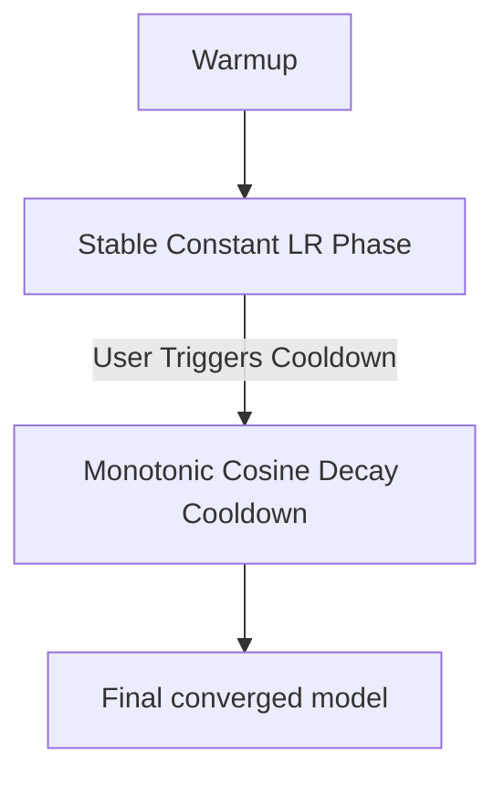

# The Checkpoint Abort and Schedule Unalignment Boundary

Standard cosine schedules require pre-specifying $T_{max}$ at the start of training. If the training run is aborted early, the learning rate might remain too high, leading to an un-converged model.

## Mitigation
Using continuous or infinite schedulers solves this by keeping the learning rate stable for an indefinite period. When the team decides to stop training, a short, dedicated "cooldown" phase (usually a 1-epoch cosine decay) is executed to finalize the weights.

## Continuous Training Lifecycle

[← Back to README](../README.md)
