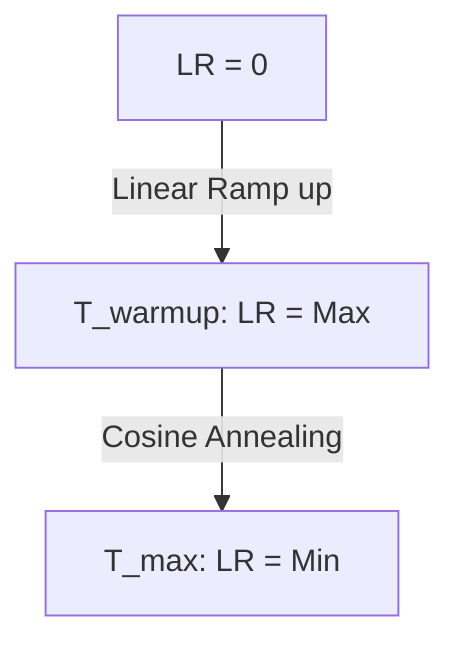

# Cosine Annealing with Linear Warmup

Combining a linear warmup phase with monotonic cosine decay helps stabilize the early stages of deep network optimization.

## Workflow
1. **Warmup Phase:** The learning rate starts at $0$ and increases linearly until it reaches $\eta_{max}$ at step $T_{warmup}$.
2. **Decay Phase:** The learning rate decays from $\eta_{max}$ to $\eta_{min}$ following a half-period cosine curve until the final training step $T_{max}$.

## Schedule Overview

[← Back to README](../README.md)
