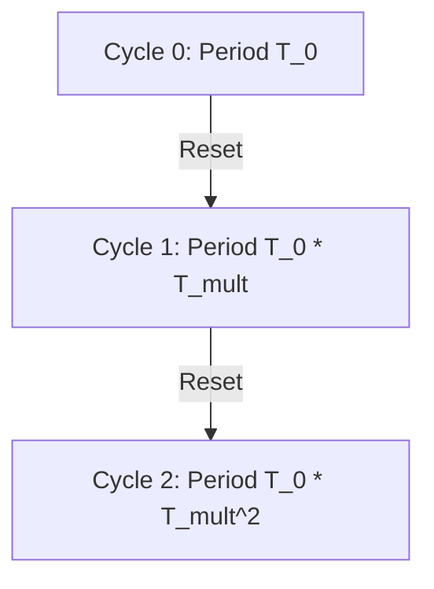

# Cosine Annealing with Warm Restarts (SGDR Class)

This variant cycles the learning rate through multiple periods, returning the learning rate to peak values at the end of each period to escape local minima.

## Mathematical Period Expansion
To improve stability, the scheduler scales the period $T_i$ of each successive run using a multiplier $T_{mult}$:
$$T_i = T_{0} \times (T_{mult})^i$$
This prevents rapid oscillatory updates that could degrade performance on non-convex training landscapes.

## Expansion Workflow

[← Back to README](../README.md)
