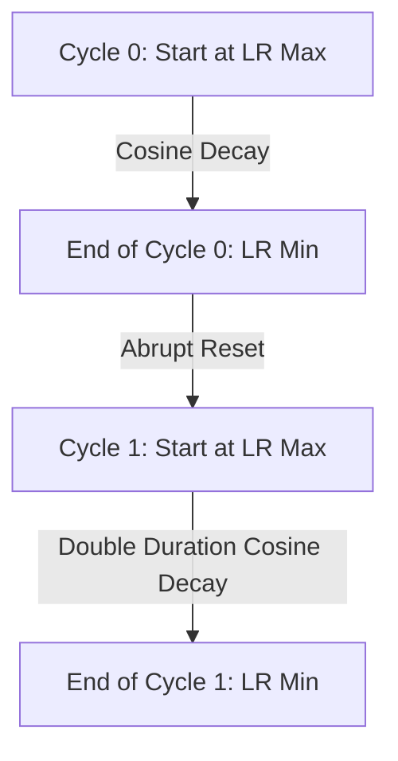

# The Cyclic Restarts Era (SGDR)

Stochastic Gradient Descent with Warm Restarts (SGDR) enhances baseline cosine annealing by introducing periodic resets. When the learning rate reaches its minimum value, it is instantly reset to its peak value, initiating a new training cycle.

## Mechanics
The periodic resets shake the model parameters out of shallow local minima or saddle points, allowing the network to explore new, potentially flatter, and more generalizable regions of the loss landscape. Often, the length of each restart cycle is expanded by a factor $T_{mult}$ (typically 2) to ensure stable convergence as training progresses.

## Cycle Progression

[← Back to README](../README.md)
