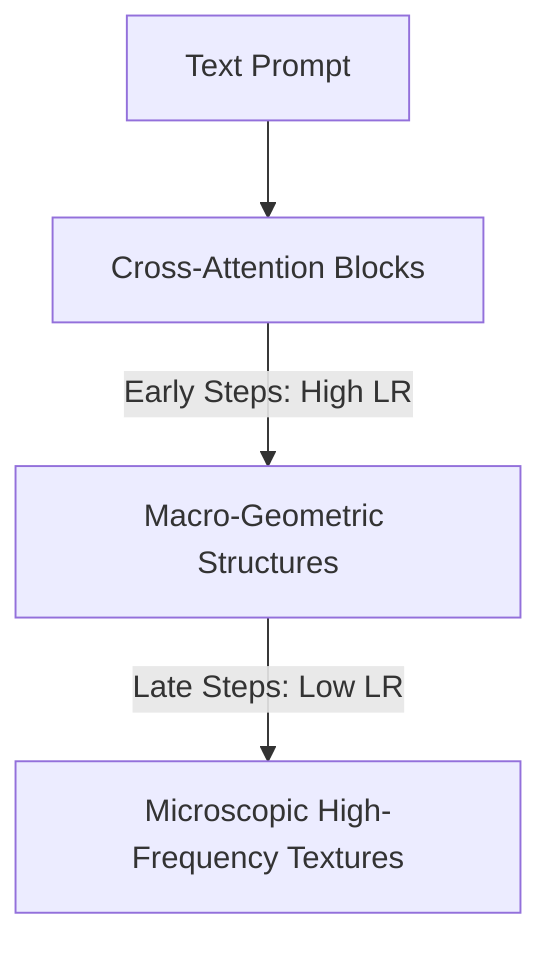

# High-Resolution Diffusion and Flow-Matching Synthesis Loops

Generative platforms like FLUX.1 and Stable Diffusion utilize deep text-image cross-attention structures that require fine-grained convergence.

## Application
Cosine annealing schedules allow these networks to balance broad macro-geometric structural features (learned during high learning rate steps) with microscopic, high-frequency image textures (refined during late decay steps with very small learning rates).

## Synthesis Pipeline

[← Back to README](../README.md)
