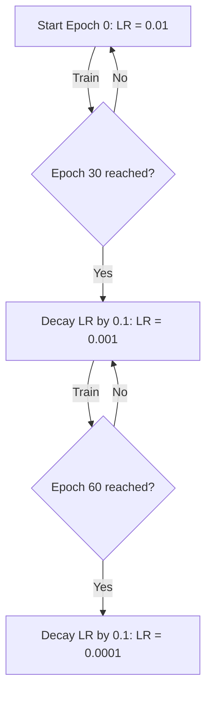

# Discontinuous Step & Heuristic Decay Era (Traditional ML, Pre-2016)

Traditional machine learning and early deep learning systems relied primarily on manual, step-based learning rate decay. This paradigm decay schedules the learning rate by a fixed multiplicative factor (such as 0.1) at pre-defined training milestones or when the validation loss plateaus.

## Mechanism & Theory
In a step-decay regime, the learning rate $\eta_t$ is updated at epoch $t$ as follows:
$$\eta_t = \eta_0 \cdot \gamma^{\lfloor t / s \rfloor}$$
where:
* $\eta_0$ is the initial learning rate.
* $\gamma \in (0, 1)$ is the decay factor (typically $0.1$ or $0.5$).
* $s$ is the step size (interval of epochs/steps between decays).

While simple to implement, it introduces discontinuous updates which cause gradient shocks to network parameters, often leading to optimization instability or stagnation near sharp saddle points.

## Visualization

[← Back to README](../README.md)
