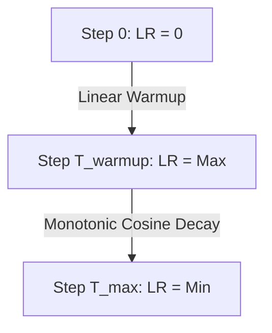

# The Linear Warmup & Unified Transformer Pre-Training Era (~2020–Present)

Modern large language models and foundational transformers train on massive datasets with large batch sizes. Standard cosine annealing from step zero can lead to early optimization divergence because gradients are highly unstable at the beginning of training.

## Mechanism
To mitigate early instability, a **Linear Warmup Phase** is prepended. During the warmup phase, the learning rate increases linearly from zero to the maximum targeted learning rate $\eta_{max}$ over $T_{warmup}$ steps, followed by a standard monotonic cosine decay.

## Warmup and Decay Phases

[← Back to README](../README.md)
