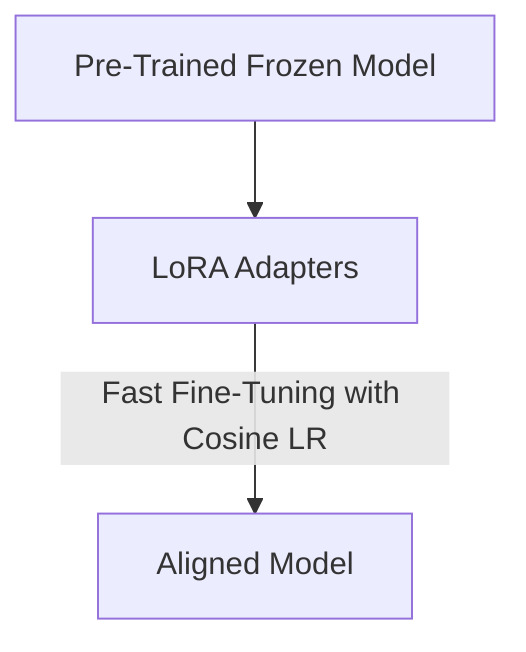

# Distributed Low-Rank Post-Training Alignment Sprints (LoRA / QLoRA)

Fine-tuning foundation models for downstream alignment (like RLHF or DPO) typically employs parameter-efficient adapters like LoRA or QLoRA.

## Application
Because alignment training runs on specialized enterprise data over short duration sprints, cosine annealing schedulers are critical to prevent over-fitting. The smooth decay ensures model adapters adjust weights precisely without breaking the base model's pre-trained knowledge base.

## Fine-Tuning Pipeline

[← Back to README](../README.md)
