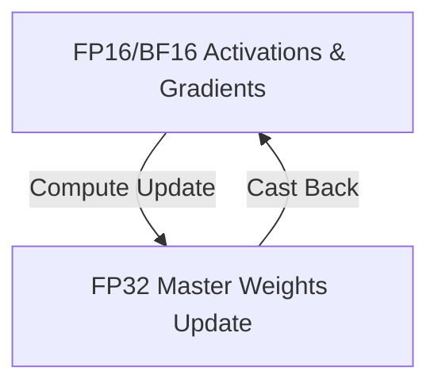

# The Master Weight Precision and Underflow Hazard

During mixed-precision training (e.g., FP16 or BF16), very small learning rates towards the end of cosine annealing cycles can cause update underflow.

## Problem & Mitigation
When $\eta_t \to 10^{-6}$ and gradients are small, multiplying them together yields values that cannot be represented in half-precision floats, rounding them to zero. The mitigation is to store and update a master copy of the weights in FP32 precision, while performing high-speed forward and backward passes in FP16/BF16.

## Information Flow

[← Back to README](../README.md)
