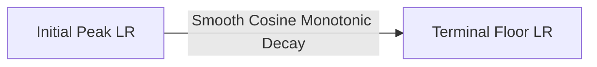

# Monotonic Cosine Decay (No Restarts)

Monotonic Cosine Decay is a simplified variant of cosine annealing where the learning rate decreases continuously to a baseline floor over a single training period without any restart cycles.

## Behavior
This setup is currently the default standard for training massive Transformer architectures (e.g., GPT models, LLama, Mistral) where training runs are extremely computationally expensive and cyclic restarts would prevent convergence on the massive target corpus.

## Schedule Phases

[← Back to README](../README.md)
