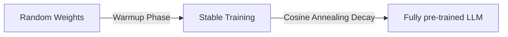

# Pre-Training Web-Scale Foundational Transformers (Llama / Mistral / DeepSeek)

Pre-training foundational transformers requires stable optimization algorithms that can scale to trillions of tokens.

## Application
In this domain, monotonic cosine annealing schedules paired with a linear warmup phase are universally applied. Warmup prevents gradient explosion during the initial steps when loss is high, while cosine decay helps optimizer variables steadily cool down to ensure high-quality, generalizable token-prediction representations.

## Pre-Training Stages

[← Back to README](../README.md)
