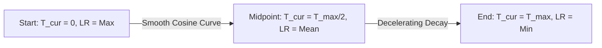

# The Continuous Waveform Revolution (Vanilla Cosine Annealing, 2016)

Vanilla Cosine Annealing introduces a smooth, continuous learning rate schedule modeled after the cosine function. Instead of discrete steps, the learning rate declines monotonically to a minimum value over the training run.

## Mathematical Formulation
The learning rate at training step $T_{cur}$ within a maximum step allocation of $T_{max}$ is formulated as:
$$\eta_t = \eta_{min} + \frac{\eta_{max} - \eta_{min}}{2} \left( 1 + \cos\left(\frac{T_{cur}}{T_{max}}\pi\right) \right)$$
By adjusting the learning rate along a continuous curve, the weights settle smoothly into deep local minima without experiencing abrupt gradient updates.

## Optimization Curve

[← Back to README](../README.md)
